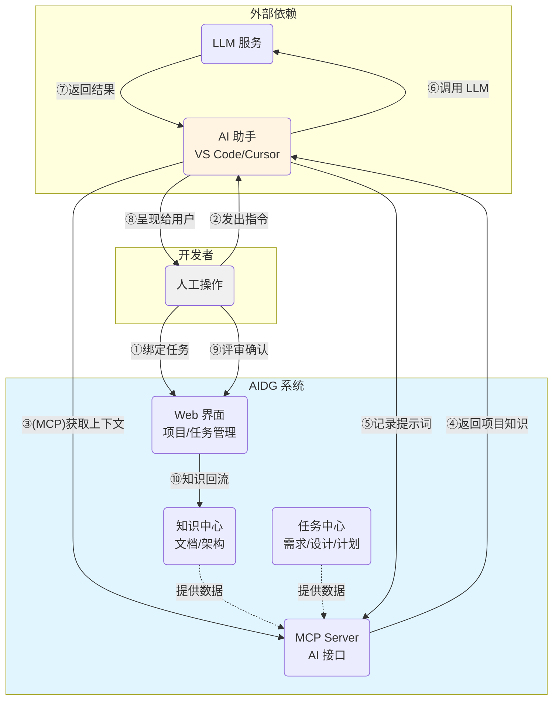

# AIDG (AI-Dev-Gov)

[](https://golang.org)
[](https://nodejs.org)
[](https://www.docker.com)
[](LICENSE)

---

## 📖 简介

AIDG (AI Development Governance)  **Spec-Driven Development (SDD)** 的实践工具。提供人机协作的平台，在软件开发的特性设计、架构设计、任务分解、需求文档、设计文档等关键环节设置锚点，控制AI生成空间。

---

### 💡 工作原理示意图



**核心流程说明**：

1. **人机协同**：开发者在 Web 界面绑定任务，在 AI 工具中发出指令
2. **上下文注入**：AI 助手通过 MCP 协议自动获取项目知识和任务上下文
3. **过程留痕**：提示词被记录后才调用 LLM，确保决策过程可追溯
4. **知识闭环**：AI 产出经人工评审后回流到知识中心，持续沉淀

---

### 🌐 Web 界面使用


#### 📝 创建用户、项目和任务

1. **创建用户** (首次使用)
   - 访问 http://localhost:8000
   - 点击"注册"创建管理员账号
   - 使用用户名/密码登录

2. **创建项目**
   - 导航至"项目管理"
   - 点击"新建项目"，填写项目名称和描述
   - 配置特性列表和架构文档

3. **创建任务**
   - 进入项目详情页
   - 点击"新建任务"，填写任务信息
   - 为任务生成需求文档和设计文档

4. **绑定当前任务**
   - 在任务列表中点击"选择为当前任务"
   - 这样 AI 工具就能自动获取该任务的上下文

---

### 🔌  MCP 服务器配置


#### 在 AI 开发工具中接入 AIDG

AIDG 基于 [Model Context Protocol (MCP)](https://modelcontextprotocol.io/) 提供标准化接口，支持任何兼容 MCP 的 AI 工具接入。

1. **获取 API Key**:
   - 在 AIDG Web 界面登录
   - 导航至"用户设置" → "API 令牌"
   - 复制 JWT Token 并填入配置文件

2. **添加 AIDG MCP Server**:
   在 `config.json` 中添加 MCP 服务器配置：
   ```json
   {
     "mcpServers": {
       "aidg": {
         "url": "http://localhost:8001/mcp",
         "headers": {
           "Authorization": "Bearer your-jwt-token-here"
         }
       }
     }
   }
   ```

---

## 📚 详细部署方案

详细配置请参考：[**部署指南 (DEPLOYMENT.md)**](docs/DEPLOYMENT.md)

### 📖 部署方案选择

AIDG 提供三种部署方案：

| 方案 | 镜像大小 | 服务组成 | 适用场景 |
|------|---------|---------|----------|
| **Lite** | ~250MB | aidg | 项目/任务管理、文档管理、MCP 接入 |
| **Standard** | ~2.3GB | aidg + deps + whisper | + 音频转换、说话人分离、语音转录 |
| **Full** | ~4.5GB | 全部服务 | + 语义搜索 |

**部署建议**：
- 🎯 只需要 AI 治理、任务管理、文档管理 → **Lite** 方案
- 🎙️ 需要会议录音自动转写功能 → **Standard** 方案
- 🔍 需要语义搜索功能 → **Full** 方案

### 🏗️ 架构说明

```
┌─────────────────────────────────────────────────────────────────────┐
│                         AIDG 服务架构                                │
├─────────────────────────────────────────────────────────────────────┤
│                                                                      │
│  ┌─────────────────────────────────────────────────────────────┐    │
│  │              ghcr.io/houzhh15/aidg (~250MB)                  │    │
│  │  ┌───────────┐  ┌───────────┐  ┌──────────────┐             │    │
│  │  │  server   │  │mcp-server │  │file_converter│             │    │
│  │  │  :8000    │  │  :8001    │  │   (内部)     │             │    │
│  │  └───────────┘  └───────────┘  └──────────────┘             │    │
│  └─────────────────────────────────────────────────────────────┘    │
│                              │                                       │
│                              │ HTTP (Standard/Full)                  │
│                              ↓                                       │
│  ┌──────────────────────┐  ┌──────────────────────┐                 │
│  │ ghcr.io/houzhh15/    │  │ ghcr.io/mutablelogic/│                 │
│  │ aidg-deps (~1.5GB)   │  │ go-whisper (~500MB)  │                 │
│  │ FFmpeg + PyAnnote    │  │ 语音转录             │                 │
│  │      :8080           │  │      :80             │                 │
│  └──────────────────────┘  └──────────────────────┘                 │
│                              │                                       │
│                              │ HTTP (Full only)                      │
│                              ↓                                       │
│  ┌──────────────────────────────────────────────────────────────┐   │
│  │          ghcr.io/houzhh15/aidg-nlp (~2GB)                     │   │
│  │                 text2vec 语义搜索                              │   │
│  │                      :5001                                     │   │
│  └──────────────────────────────────────────────────────────────┘   │
│                                                                      │
└─────────────────────────────────────────────────────────────────────┘
```

**服务端口**：
- Web API：**8000**（对外）
- MCP Server：**8001**（对外）
- 其他服务仅内部通信

---

## 🔧 开发指南


### 本地开发环境


#### 前置要求

```bash
# 1. 克隆仓库
git clone https://github.com/houzhh15/AIDG.git
cd AIDG

# 2. 安装依赖
make install
# 这会自动安装 Go 和前端依赖

# 3. 启动开发环境 (推荐 - 一键启动)
make dev
# 自动启动：Web Server (8000) + MCP Server (8001) + 前端 (5173)
# 自动配置开发环境变量（JWT_SECRET、USER_JWT_SECRET 等）

# 或者分别启动（便于调试）
# Terminal 1: 启动后端
ENV=development \
  JWT_SECRET=dev-jwt-secret-at-least-32-characters-long \
  USER_JWT_SECRET=dev-user-jwt-secret-at-least-32-characters-long \
  ADMIN_DEFAULT_PASSWORD=admin123 \
  go run ./cmd/server

# Terminal 2: 启动 MCP Server  
ENV=development go run ./cmd/mcp-server

# Terminal 3: 启动前端
cd frontend && npm run dev

# 4. 访问应用
# Web 界面: http://localhost:5173
# API 文档: http://localhost:8000/health
# MCP 服务: http://localhost:8001/health
```

**注意**：
- 开发模式使用 `ENV=development`（不是 `dev`）
- `make dev` 已自动配置所有必需的环境变量
- 分别启动时需要手动设置 `JWT_SECRET` 和 `USER_JWT_SECRET`（至少 32 字符）

#### 启动开发环境

```bash
# 开发构建（快速编译，用于测试）
make build
# 生成：bin/server, bin/mcp-server

# 生产构建（优化编译，包含版本信息）
make build-prod
# 1. 编译后端并嵌入版本号、构建时间、Git 提交哈希
# 2. 构建前端生产版本 (frontend/dist/)
# 3. 生成：bin/server, bin/mcp-server + 前端静态文件

# 构建 Docker 镜像
make docker-build
# 构建标签为 aidg:{version} 的镜像

# 运行测试
make test
# 运行所有 Go 单元测试（带竞态检测和覆盖率）

# 清理构建产物
make clean
# 删除 bin/ 和 frontend/dist/ 目录
```

**版本信息**：生产构建会自动嵌入以下信息
- `Version`: Git 标签或提交哈希
- `BuildTime`: 构建时间戳
- `GitCommit`: Git 提交短哈希

#### 构建生产版本

```bash
# 构建所有组件
make build

# 仅构建后端
make build-backend

# 仅构建前端
make build-frontend

# 构建 Docker 镜像
make docker-build
```

## 🔐 安全建议


### 生产环境配置检查清单

在生产环境部署前，请确保完成以下配置：

- [ ] **JWT_SECRET**: 使用至少 32 字符的随机字符串
- [ ] **ADMIN_DEFAULT_PASSWORD**: 设置强密码（包含大小写、数字、特殊字符）
- [ ] **MCP_PASSWORD**: 设置 MCP Server 访问密码
- [ ] **CORS_ALLOWED_ORIGINS**: 只允许信任的域名
- [ ] **LOG_FORMAT**: 设置为 `json` 便于日志分析
- [ ] **数据备份**: 定期备份 `data/` 目录
- [ ] **HTTPS**: 使用反向代理（Nginx/Traefik）启用 HTTPS
- [ ] **防火墙**: 限制只有必要的端口对外开放

详细安全配置，请参考 [部署指南](docs/DEPLOYMENT.md#环境变量)。

---

## 📜 许可证

本项目采用 [Apache-2.0 许可证](LICENSE)。

AIDG 的开发过程中受益于以下开源项目和社区：

- [Model Context Protocol](https://modelcontextprotocol.io/) - 标准化的 AI 工具协议
- [Gin Web Framework](https://gin-gonic.com/) - 高性能 Go Web 框架
- [React](https://react.dev/) - 现代化前端框架
- [Ant Design](https://ant.design/) - 企业级 UI 组件库
- [Whisper](https://github.com/openai/whisper) - OpenAI 语音识别模型
- [PyAnnote](https://github.com/pyannote/pyannote-audio) - 说话人识别库

> ---)