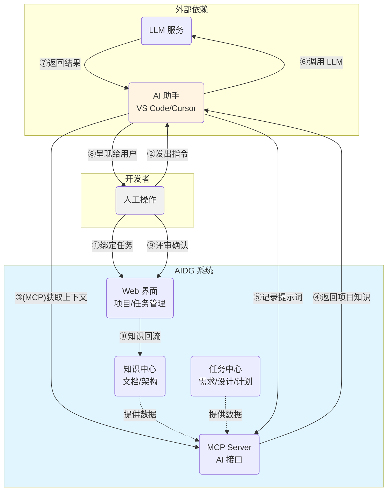

# AIDG (AI-Dev-Gov)

[](https://golang.org)
[](https://nodejs.org)
[](https://www.docker.com)
[](LICENSE)

> 探索 Spec-Driven Development (SDD) 的个人实践 | 尝试让 AI 辅助开发更可控、可追溯 | 人机协作的治理工具

---

## 📖 简介

这是一款完全由 AI 智能体开发的自用工具。

AIDG (AI Development Governance) 是一次对 **Spec-Driven Development (SDD)** 理念的个人实践尝试。它试图通过"规约先行、规约锚定"的方法，探索解决 AI 编程过程中常见的三个问题：**上下文容易丢失、开发过程难以把控、经验知识不易沉淀**。AIDG 并不追求让 AI 完全替代开发工作，而是希望构建一个"人机协作的辅助治理层"——开发者负责定义需求和审查产出，AI 负责生成方案和执行，尽可能让整个过程留痕可查。通过项目知识中心、任务三文档结构（需求-设计-测试）、执行计划导航和提示词记录，AIDG 尝试将 AI 辅助开发从依赖"灵光一现"转向依靠"积累和复用"。

### 关键特性

1. **治理闭环尝试**：探索"先获取上下文、后进行推理、关键节点需审批、过程尽量可追溯"的工作流程，尝试形成"证据—决策—产出—审计"的链条。
2. **上下文结构化**：通过多层级文档架构，尝试让信息从会议/原始素材 → 结构化知识 → 项目/任务/执行计划逐层分解，再注入开发过程，最后让经验回流沉淀。
3. **执行过程记录**：通过执行计划和提示词日志双轴记录，尝试追踪 AI "依据什么内容做了什么操作"。
4. **协议化接入**：基于 MCP 协议提供工具和提示词模板，尝试以非侵入方式融入现有开发环境，减少额外的认知负担。
5. **可视化辅助**：提供项目状态页、步骤状态、依赖图、时间维度进展、特性列表与架构文档展示，尝试降低信息管理的复杂度。

### 核心理念


#### 在 AI 开发中遇到的挑战

1. AI 工具的主要瓶颈可能不在模型本身，而在于如何管理上下文和开发过程
2. AI 辅助开发的价值，或许更多在于让人和 AI 的协作过程"相互对齐"并"留下记录"
3. 在 AI 时代，开发者的工作重心正在从"编写代码"转向"定义需求、组织上下文和审查产出"

#### 一些思考

1. AI 的"无状态"特性与项目开发的"有状态"需求存在矛盾，尝试通过外部治理层来弥补
2. 治理的目的不是限制 AI，而是尝试把 AI 的能力从"一次性灵感"转化为"可复用的资产"
3. 提示词模板可能是一种将个人经验从"隐性知识"转化为"显性协议"的方式
4. 通过导航算法让执行计划成为"动态文档"，执行状态本身可以作为对计划合理性的反馈

#### AIDG 希望探索的方向

1. 在复杂系统中支持"发散探索-收敛总结"的知识迭代模式
2. 通过过程透明化来辅助质量把控和持续改进
3. 尝试维护单一事实来源 (SSoT)，减少信息不一致的情况

---

## 🚀 快速开始 (Getting Started)


### 💡 工作原理示意图



**核心流程说明**：

1. **人机协同**：开发者在 Web 界面绑定任务，在 AI 工具中发出指令
2. **上下文注入**：AI 助手通过 MCP 协议自动获取项目知识和任务上下文
3. **过程留痕**：提示词被记录后才调用 LLM，确保决策过程可追溯
4. **知识闭环**：AI 产出经人工评审后回流到知识中心，持续沉淀

---

### 📦 1. 快速部署（5 分钟）

详细步骤请参考：[**快速开始指南 (QUICK_START.md)**](docs/QUICK_START.md)

**超简版**:

```bash
# 1. 下载配置文件
curl -O https://raw.githubusercontent.com/houzhh15/AIDG/main/docker-compose.ghcr.yml

# 2. 启动服务（基础版，100MB）
docker compose -f docker-compose.ghcr.yml up -d

# 3. 打开浏览器访问
open http://localhost:8000
```

> 💡 **提示**: 基础版（100MB）已包含核心功能。如需会议录音转写功能，请参考完整部署方案。

---

### 🌐 2. Web 界面使用


#### 📝 创建用户、项目和任务

1. **创建用户** (首次使用)
   - 访问 http://localhost:8000
   - 点击"注册"创建管理员账号
   - 使用用户名/密码登录

2. **创建项目**
   - 导航至"项目管理"
   - 点击"新建项目"，填写项目名称和描述
   - 配置特性列表和架构文档

3. **创建任务**
   - 进入项目详情页
   - 点击"新建任务"，填写任务信息
   - 为任务生成需求文档和设计文档

4. **绑定当前任务**
   - 在任务列表中点击"选择为当前任务"
   - 这样 AI 工具就能自动获取该任务的上下文

---

### 🔌 3. MCP 服务器配置


#### 在 AI 开发工具中接入 AIDG

AIDG 基于 [Model Context Protocol (MCP)](https://modelcontextprotocol.io/) 提供标准化接口，支持任何兼容 MCP 的 AI 工具接入。

1. **获取 API Key**:
   - 在 AIDG Web 界面登录
   - 导航至"用户设置" → "API 令牌"
   - 复制 JWT Token 并填入配置文件

2. **添加 AIDG MCP Server**:
   在 `config.json` 中添加 MCP 服务器配置：
   ```json
   {
     "mcpServers": {
       "aidg": {
         "url": "http://localhost:8081/mcp",
         "headers": {
		"Authorization": "Bearer your-jwt-token-here"
	 }
       }
     }
   }	
   ```

---

### 🔄 4. 完整开发流程

AIDG 的工作流与 MCP（Model Context Protocol）内置的提示词模板紧密集成，实现引导式的、结构化的开发流程。

**提示词模板使用方式**：
- 在 VS Code 中输入：`/mcp.aidg.{prompt-name}`
- 例如：`/mcp.aidg.requirements` 或 `/mcp.aidg.design`

**典型开发流程**：

1.  **需求文档生成**
    *   在 Web 界面创建任务后，使用提示词模板引导 AI 生成需求文档
    *   `/mcp.aidg.requirements` - 基于项目特性列表和任务描述生成需求文档

2.  **设计文档生成**
    *   基于需求文档，引导 AI 生成技术设计
    *   `/mcp.aidg.design` - 创建技术设计，包括模块划分、接口定义等

3.  **执行计划提交**
    *   AI 根据设计文档生成详细的、可分步执行的计划
    *   `/mcp.aidg.planning` - 生成编码或操作步骤的执行计划
    *   人工在 Web 界面对计划进行审批，确保执行方向正确

4.  **自主执行与追踪**
    *   计划审批后，AI 通过 MCP 工具获取下一步操作
    *   `/mcp.aidg.executing` - 按计划逐步执行，自动获取可执行步骤
    *   完成后通过 MCP 工具回写执行状态和结果
    *   整个过程在 Web 界面实时追踪，确保过程可控

5.  **任务总结**
    *   任务完成后生成结构化总结
    *   `/mcp.aidg.task_summary` - 生成任务完成报告，记录关键产出和经验

**提示词模板位置**：`cmd/mcp-server/prompts/*.prompt.md`


## 📚 详细部署方案

想了解更多部署细节？我们为你准备了三份文档：

### 📖 文档导航

AIDG 采用统一容器架构，提供三个 Docker 镜像：

**基础镜像 - aidg-aidg** (~100MB)  
包含 Web Server（REST API + 人机交互界面）、MCP Server（AI 工具接口）和 Frontend（React 单页应用）。适合大部分场景，提供完整的项目管理、任务管理、文档管理和 AI 治理功能。

**依赖服务 - aidg-deps-service** (~2GB)  
提供说话人识别服务（基于 PyAnnote AI 模型）。仅在需要会议录音转写和说话人分离功能时使用。

**语音转写 - go-whisper** (~500MB)  
提供 Whisper 语音转写服务（基于 OpenAI Whisper 模型）。仅在需要会议录音自动转文字功能时使用。

**部署建议**：
- 🎯 只需要 AI 治理、任务管理、文档管理 → 基础版（100MB）
- 🎙️ 需要会议录音自动转写功能 → 完整版（~2.5GB，三个镜像全部部署）

### 🏗️ 架构说明

AIDG 采用统一容器架构，提供三个 Docker 镜像：

| **aidg-aidg** | ~100MB | Web Server + MCP Server + Frontend | 基础版，适合大部分场景 |
| **aidg-deps-service** | ~2GB | 说话人识别服务 (PyAnnote) | 完整版，需要会议功能 |
| **go-whisper** | ~500MB | Whisper 语音转写服务 | 完整版，需要会议功能 |

#### 🎨 三个镜像的关系

```
┌─────────────────────────────────────────────────────────────┐
│                       基础版部署                              │
│  ┌────────────────────────────────────────────────────────┐ │
│  │  aidg-aidg (100MB)                                    │ │
│  │  ├── Web Server (REST API + 人机交互界面)              │ │
│  │  ├── MCP Server (AI 工具接口)                         │ │
│  │  └── Frontend (React 单页应用)                        │ │
│  └────────────────────────────────────────────────────────┘ │
│                                                               │
│  ✅ 支持: 项目管理、任务管理、文档管理、AI 治理、进度追踪      │
│  ❌ 不支持: 会议录音转写、说话人识别                          │
└─────────────────────────────────────────────────────────────┘

┌─────────────────────────────────────────────────────────────┐
│                       完整版部署                              │
│  ┌────────────────────────────────────────────────────────┐ │
│  │  aidg-aidg (100MB)                                    │ │
│  │  ├── Web Server                                       │ │
│  │  ├── MCP Server                                       │ │
│  │  └── Frontend                                         │ │
│  └───────────┬────────────────────────────────────────────┘ │
│              │                                               │
│              │ HTTP 调用                                     │
│              │                                               │
│              ↓                                               │
│  ┌────────────────────────────────────────────────────────┐ │
│  │  aidg-deps-service (2GB)                              │ │
│  │  └── PyAnnote (说话人识别 AI 模型)                     │ │
│  └────────────────────────────────────────────────────────┘ │
│              ↓                                               │
│  ┌────────────────────────────────────────────────────────┐ │
│  │  go-whisper (500MB)                                   │ │
│  │  └── Whisper (语音转写 AI 模型)                        │ │
│  └────────────────────────────────────────────────────────┘ │
│                                                               │
│  ✅ 支持: 所有功能 + 会议录音转写 + 说话人识别                 │
└─────────────────────────────────────────────────────────────┘
```

**选择建议**:
- 🎯 **只需要 AI 治理、任务管理、文档管理** → 基础版（100MB）
- 🎙️ **需要会议录音自动转写功能** → 完整版（~2.5GB）

更多架构细节，请参考 [架构迁移文档](docs/ARCHITECTURE_MIGRATION.md)。

---

## 🔧 开发指南


### 本地开发环境


#### 前置要求

```bash
# 1. 克隆仓库
git clone https://github.com/houzhh15/AIDG.git
cd AIDG

# 2. 安装依赖
make install
# 这会自动安装 Go 和前端依赖

# 3. 启动开发环境 (推荐 - 一键启动)
make dev
# 自动启动：Web Server (8000) + MCP Server (8081) + 前端 (5173)
# 自动配置开发环境变量（JWT_SECRET、USER_JWT_SECRET 等）

# 或者分别启动（便于调试）
# Terminal 1: 启动后端
ENV=development \
  JWT_SECRET=dev-jwt-secret-at-least-32-characters-long \
  USER_JWT_SECRET=dev-user-jwt-secret-at-least-32-characters-long \
  ADMIN_DEFAULT_PASSWORD=admin123 \
  go run ./cmd/server

# Terminal 2: 启动 MCP Server  
ENV=development go run ./cmd/mcp-server

# Terminal 3: 启动前端
cd frontend && npm run dev

# 4. 访问应用
# Web 界面: http://localhost:5173
# API 文档: http://localhost:8000/health
# MCP 服务: http://localhost:8081/health
```

**注意**：
- 开发模式使用 `ENV=development`（不是 `dev`）
- `make dev` 已自动配置所有必需的环境变量
- 分别启动时需要手动设置 `JWT_SECRET` 和 `USER_JWT_SECRET`（至少 32 字符）

#### 启动开发环境

```bash
# 开发构建（快速编译，用于测试）
make build
# 生成：bin/server, bin/mcp-server

# 生产构建（优化编译，包含版本信息）
make build-prod
# 1. 编译后端并嵌入版本号、构建时间、Git 提交哈希
# 2. 构建前端生产版本 (frontend/dist/)
# 3. 生成：bin/server, bin/mcp-server + 前端静态文件

# 构建 Docker 镜像
make docker-build
# 构建标签为 aidg:{version} 的镜像

# 运行测试
make test
# 运行所有 Go 单元测试（带竞态检测和覆盖率）

# 清理构建产物
make clean
# 删除 bin/ 和 frontend/dist/ 目录
```

**版本信息**：生产构建会自动嵌入以下信息
- `Version`: Git 标签或提交哈希
- `BuildTime`: 构建时间戳
- `GitCommit`: Git 提交短哈希

#### 构建生产版本

```bash
# 构建所有组件
make build

# 仅构建后端
make build-backend

# 仅构建前端
make build-frontend

# 构建 Docker 镜像
make docker-build
```

## 🔐 安全建议


### 生产环境配置检查清单

在生产环境部署前，请确保完成以下配置：

- [ ] **JWT_SECRET**: 使用至少 32 字符的随机字符串
- [ ] **ADMIN_DEFAULT_PASSWORD**: 设置强密码（包含大小写、数字、特殊字符）
- [ ] **MCP_PASSWORD**: 设置 MCP Server 访问密码
- [ ] **CORS_ALLOWED_ORIGINS**: 只允许信任的域名
- [ ] **LOG_FORMAT**: 设置为 `json` 便于日志分析
- [ ] **数据备份**: 定期备份 `data/` 目录
- [ ] **HTTPS**: 使用反向代理（Nginx/Traefik）启用 HTTPS
- [ ] **防火墙**: 限制只有必要的端口对外开放

详细安全配置，请参考 [环境变量配置手册](docs/ENVIRONMENT_VARIABLES.md)。

---

## 📜 许可证

本项目采用 [Apache-2.0 许可证](LICENSE)。

AIDG 的开发过程中受益于以下开源项目和社区：

- [Model Context Protocol](https://modelcontextprotocol.io/) - 标准化的 AI 工具协议
- [Gin Web Framework](https://gin-gonic.com/) - 高性能 Go Web 框架
- [React](https://react.dev/) - 现代化前端框架
- [Ant Design](https://ant.design/) - 企业级 UI 组件库
- [Whisper](https://github.com/openai/whisper) - OpenAI 语音识别模型
- [PyAnnote](https://github.com/pyannote/pyannote-audio) - 说话人识别库

> ---)